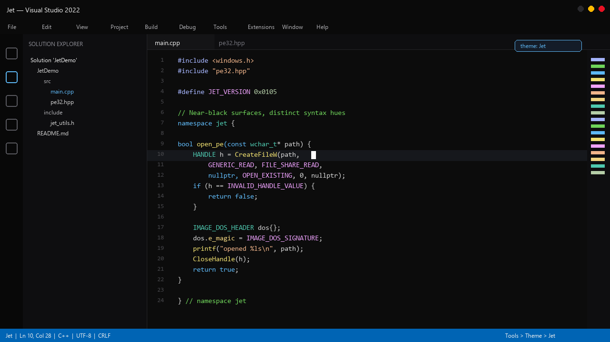

# Jet


A near-black dark theme for Visual Studio 2019 and later.

Jet is a darkened take on Visual Studio's built-in **Dark** theme. Shell and editor surfaces are pushed toward almost-OLED depth without pure black everywhere, so panels keep a thin charcoal separation. Syntax colors are boosted for contrast on near-black while keeping distinct hues (for example, cool violet for preprocessor vs warm magenta for macros).



## Features

- Based on Visual Studio Dark (`Theme.Dark` + editor colors + C++ semantic colors)
- Near-OLED surfaces with a floor of about `#0A0A0A` (not pure black everywhere)
- Editor background darkened from `#1E1E1E` toward `#0C0C0C`
- Vibrant, distinct syntax palette (keywords, strings, functions, macros, preprocessor)
- White VsVim block caret
- Compatible with Visual Studio 2019 (x86) and Visual Studio 2022+ (amd64 / arm64)

## Installation

1. Close Visual Studio.
2. Download and double-click `Jet.vsix` from [Releases](https://github.com/digitizable/Jet/releases), or build from source.
3. Start Visual Studio.
4. **Tools > Theme > Jet**

If the theme does not appear, run:

```text
devenv /updateconfiguration
```

then restart Visual Studio.

## Color notes

| Role | Approx. color |
|------|----------------|
| Environment / editor surfaces | `#0A0A0A`–`#0C0C0C` |
| Keywords | `#5EB8F5` |
| Functions (`printf`, …) | `#F0E070` |
| Member fields (`pe32.dwSize`) | `#F0D480` |
| Preprocessor (`#include`) | `#A5B4FC` (cool violet) |
| Macros (`INVALID_HANDLE_VALUE`) | `#F0A3FF` (warm magenta) |
| Comments | `#6FD45A` |
| Strings | `#F0B48A` |

## Layout

| Path | Description |
|------|-------------|
| `JetProject/CustomTheme.pkgdef` | Theme package |
| `JetProject/source.extension.vsixmanifest` | VSIX identity |
| `Jet.vsix` | Installer |
| `Jet.sln` | Solution stub |

## Building

`CustomTheme.pkgdef` is derived from Visual Studio Dark theme packages (GUID remap + darkening + syntax palette). Package a VSIX with `extension.vsixmanifest`, `CustomTheme.pkgdef`, and icons (see existing `Jet.vsix` structure).

## Attribution

Surface and editor color definitions originate from Visual Studio Dark theme packages (Microsoft). Jet is a derivative darkening and palette adjustment under MIT.

Copyright (c) 2026 Anguish

## License

MIT License. See [LICENSE](LICENSE).